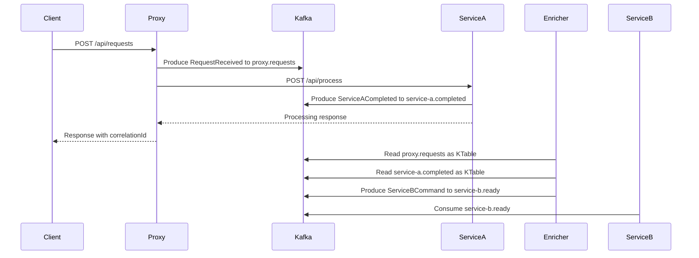

# Confluent Lab — Proxy → Service A → Enricher → Service B (.NET 10)

A production-oriented PoC of an asynchronous **fan-out + stream-join** pattern on Kafka /
Confluent. A synchronous HTTP call fronts a Kafka pipeline, and **Service B is fully decoupled
from the raw request** — it only ever consumes an *enriched* message that an Enricher produces
after joining the original request with Service A's completion event, keyed by `correlationId`.

> **Enricher implementation note:** two interchangeable Enrichers are provided — a **manual
> `KTable ⋈ KTable` equivalent** (`Confluent.Kafka` + durable SQLite state + an idempotent output
> ledger, the **default**) and a **Streamiz.Kafka.Net DSL** version (`requests.Join(completions, …)`).
> Pick one at deploy time via a Docker Compose profile (see
> [Switching the enricher](#switching-the-enricher)). Both implement Kafka Streams KTable-KTable inner
> join semantics on `correlationId`; the manual one additionally guarantees exactly-once output and
> exposes the required per-stage metrics (see [Enricher design](#enricher-the-core)).

---

## Architecture



### Flow

```
Client
  -> Proxy API  (POST /api/requests)
      -> Kafka: proxy.requests          (RequestReceived, key=correlationId)
      -> HTTP  : Service A /api/process  (synchronous, Polly resilience)
      <- Service A response
  <- response to Client (correlationId + Service A IDs)

Service A
  -> Kafka: service-a.completed          (ServiceACompleted, key=correlationId)

Enricher  (manual KTable-KTable join)
  -> materializes proxy.requests      as a durable table
  -> materializes service-a.completed as a durable table
  -> joins by correlationId, emits exactly once
  -> Kafka: service-b.ready              (ServiceBCommand, key=correlationId)

Service B
  -> consumes service-b.ready ONLY; retries; DLQ on exhaustion -> service-b.dlq
```

## Projects

```
src/
  Poc.Contracts/        Strongly typed message contracts (records)
  Poc.Kafka/            Shared: options, idempotent producer/consumer factories, JSON-Schema serdes,
                        topic provisioning, Kafka health check, OpenTelemetry wiring
  Poc.Proxy.Api/        POST /api/requests — produce raw request + sync call to Service A
  Poc.ServiceA.Api/     POST /api/process  — generate IDs, emit ServiceACompleted via outbox seam
  Poc.Enricher.Streams/ Manual KTable-KTable join over a durable SQLite state store
  Poc.Enricher.Streamiz/ Same join via the Streamiz.Kafka.Net Kafka Streams DSL (selectable)
  Poc.ServiceB.Worker/  Consumes service-b.ready only; bounded retry; DLQ
tests/
  Poc.IntegrationTests/ xUnit + Testcontainers (Kafka + Schema Registry) — the 9 acceptance cases
```

## Topics

| Topic                 | Key             | Retention          | Produced by | Consumed by |
|-----------------------|-----------------|--------------------|-------------|-------------|
| `proxy.requests`      | `correlationId` | `compact` (KTable) | Proxy       | Enricher    |
| `service-a.completed` | `correlationId` | `compact` (KTable) | Service A   | Enricher    |
| `service-b.ready`     | `correlationId` | `delete`           | Enricher    | Service B   |
| `service-b.dlq`       | `correlationId` | `delete`           | Service B   | (operators) |

**Every event for one request shares `key = correlationId`.** The two KTable source topics are
log-compacted so the materialized "latest value per key" semantics match a Kafka Streams `KTable`.

## Message contracts (JSON Schema via Confluent Schema Registry)

Contracts live in `Poc.Contracts` as records; JSON Schemas are auto-generated and registered on
first publish (`AutoRegisterSchemas=true`) under the `<topic>-value` subject. Wire format is
camelCase.

`RequestReceived` → `proxy.requests`
```json
{
  "correlationId": "string",
  "requestId": "string",
  "createdAtUtc": "2026-06-11T12:00:00Z",
  "payload": { "customerExternalId": "string", "amount": 42.50, "description": "string" }
}
```

`ServiceACompleted` → `service-a.completed`
```json
{
  "correlationId": "string",
  "completedAtUtc": "2026-06-11T12:00:00Z",
  "serviceAIds": { "customerId": "string", "operationId": "string", "internalRequestId": "string" }
}
```

`ServiceBCommand` → `service-b.ready`
```json
{
  "correlationId": "string",
  "createdAtUtc": "2026-06-11T12:00:00Z",
  "originalPayload": { "customerExternalId": "string", "amount": 42.50, "description": "string" },
  "serviceAIds": { "customerId": "string", "operationId": "string", "internalRequestId": "string" }
}
```

## Enricher (the core)

The Enricher is the manual equivalent of:

```text
KTable(proxy.requests)  ⋈  KTable(service-a.completed)  ON correlationId  ->  service-b.ready
```

A single consumer subscribes to **both** input topics (group `enricher`). For each record, inside one
SQLite transaction:

1. Upsert the value into the corresponding table (`requests` / `completions`) — latest-value-per-key,
   i.e. the materialized KTable.
2. Look up the **opposite** table by `correlationId`.
3. If **both** sides exist and the `correlationId` is not in the `emitted` ledger:
   build `ServiceBCommand`, produce it to `service-b.ready` (idempotent producer, **await ack**),
   record the key in `emitted`, commit the SQLite transaction, then commit the Kafka offset.
4. If only one side exists → emit nothing (logged as unmatched).
5. If both exist but already emitted → emit nothing, count as a duplicate.

This satisfies every acceptance requirement:

| Requirement                                    | How |
|------------------------------------------------|-----|
| Emit only when **both** events exist           | Inner-join lookup against the opposite table |
| Works regardless of arrival order              | Both tables are durable; whichever arrives second triggers the join |
| Exactly one output per `correlationId`         | `emitted` ledger guards re-emission |
| No duplicate outputs on duplicate inputs       | Re-delivered request/completion hits the `emitted` guard |
| Safe on restart                                | State + ledger persist in SQLite; offsets commit only after the join is durable |
| Unmatched records logged                       | Info log with `correlationId` |
| Metrics                                        | See below |

### Metrics (OpenTelemetry → Prometheus at `/metrics`)

- `enricher_joined_records` — joins emitted (counter)
- `enricher_failed_records` — processing failures (counter)
- `enricher_duplicate_records` — inputs for an already-emitted key (counter)
- `enricher_pending_requests` — requests materialized but not yet joined (gauge)
- `enricher_pending_completions` — completions materialized but not yet joined (gauge)

### Two interchangeable Enricher implementations

Both implementations produce the same `ServiceBCommand` to `service-b.ready`; pick one at deploy time
(see [Switching the enricher](#switching-the-enricher)). They share the same contracts, topics, and
camelCase JSON-Schema wire format, so the rest of the pipeline is identical.

| | `Poc.Enricher.Streams` (manual, default) | `Poc.Enricher.Streamiz` (DSL) |
|---|---|---|
| Library | `Confluent.Kafka` only | `Streamiz.Kafka.Net` 1.8.1 |
| Join | hand-written lookup over two tables | `requests.Join(completions, ...)` DSL |
| State store | SQLite (WAL) | RocksDB + changelog topics (managed) |
| Output dedup | explicit `emitted` ledger → exactly one per correlationId | raw KTable join **re-emits on every same-key update** |
| Custom metrics | `joined`/`pending_*`/`duplicate`/`failed` | Streamiz-managed internal metrics |
| Offsets / rebalancing | manual, explicit | managed by the framework |
| Lines of join code | ~120 | ~15 |

The Streamiz topology is exactly the spec's sketch
([`StreamizEnricherService`](src/Poc.Enricher.Streamiz/StreamizEnricherService.cs)):

```csharp
var requests    = builder.Table(proxyRequests,    new StringSerDes(), new SchemaJsonSerDes<RequestReceived>(settings));
var completions = builder.Table(serviceACompleted, new StringSerDes(), new SchemaJsonSerDes<ServiceACompleted>(settings));

requests
    .Join(completions, (request, completion) => new ServiceBCommand {
        CorrelationId   = request.CorrelationId,
        CreatedAtUtc    = DateTimeOffset.UtcNow,
        OriginalPayload = request.Payload,
        ServiceAIds     = completion.ServiceAIds,
    })
    .ToStream()
    .To(serviceBReady, new StringSerDes(), new SchemaJsonSerDes<ServiceBCommand>(settings));
```

**Why the manual one is the default:** the requirements demand control a black-box DSL join does not
expose — an idempotency ledger for *exactly one* output per correlationId (a raw KTable-KTable join
re-emits on every same-key update), the explicit `pending_requests`/`pending_completions`/`duplicate`/
`failed` metrics, and transparent restart/offset semantics. The Streamiz version is included to show
the concise DSL equivalent for comparison; for true exactly-once with it you would add a downstream
suppress/dedup stage.

### Switching the enricher

The two are wired into Docker Compose under profiles; **run only one at a time** (both consume the
inputs and write to `service-b.ready`).

```bash
docker compose --profile manual   up -d --build   # manual KTable-KTable (Poc.Enricher.Streams)
docker compose --profile streamiz up -d --build   # Streamiz DSL       (Poc.Enricher.Streamiz)
```

Or set a default once in `.env` (`COMPOSE_PROFILES=manual` — see `.env.example`) and just run
`docker compose up -d --build`. Both expose `/health` and `/metrics` on host port `5082`.

## Reliability

| Concern                  | Implementation |
|--------------------------|----------------|
| Idempotent producers     | `EnableIdempotence=true`, `Acks=All`, `MaxInFlight=5` (`KafkaClientFactory`) |
| Correlation propagation  | `x-correlation-id` header + log scope on every hop; `correlationId` is the Kafka key |
| Retry policies           | Proxy→Service A: `AddStandardResilienceHandler`; Service B: bounded in-loop retry |
| Dead-letter              | Service B routes exhausted messages to `service-b.dlq` with error headers |
| Durable Enricher state   | SQLite (WAL, `synchronous=FULL`) materialized tables + `emitted` ledger |
| Safe restart             | Offset committed only after the join is durably recorded; ledger blocks re-emit |
| Duplicate handling       | `emitted` ledger (input dupes & restart); idempotent producer (retry dupes) |
| Consumer group IDs       | `enricher`, `service-b` (configurable) |
| Offset commit strategy   | Manual commit after successful processing only |
| Graceful shutdown        | `consumer.Close()` on cancellation; hosted services stop cleanly |
| Structured logging       | `ILogger` scopes carry `CorrelationId`; `IncludeScopes=true` |

## Running locally

Prerequisites: Docker + Docker Compose. (.NET 10 SDK only needed to run/test outside containers.)

```bash
docker compose up -d --build
```

This starts Kafka (KRaft), Schema Registry, Kafka UI, a one-shot topic creator, and the four
services. Endpoints:

| Service        | URL |
|----------------|-----|
| Proxy API      | http://localhost:5080 |
| Service A API  | http://localhost:5081 |
| Enricher       | http://localhost:5082 (`/health`, `/metrics`) |
| Service B      | http://localhost:5083 (`/health`, `/metrics`) |
| Kafka UI       | http://localhost:8080 |
| Schema Registry| http://localhost:8081 |

Topics are created by the `kafka-init` job and, as a backstop, by each service on startup. Health
checks are exposed at `/health` on every service.

### Test with curl

```bash
curl -s -X POST http://localhost:5080/api/requests \
  -H 'content-type: application/json' \
  -d '{"customerExternalId":"cust-123","amount":42.50,"description":"first order"}'
```

Response:

```json
{
  "correlationId": "0f3c...",
  "status": "completed",
  "serviceAIds": { "customerId": "cust-...", "operationId": "op-...", "internalRequestId": "intreq-..." }
}
```

Then in **Kafka UI** (http://localhost:8080) confirm one record on each of `proxy.requests`,
`service-a.completed`, and `service-b.ready` sharing the same key = `correlationId`, and check the
`service-b-worker` logs for the processed command:

```bash
docker compose logs -f service-b-worker
```

Negative check — stop Service A and post again; the request is held by the Enricher and **nothing**
reaches `service-b.ready` until a matching completion exists:

```bash
docker compose stop service-a-api
curl -s -X POST http://localhost:5080/api/requests -H 'content-type: application/json' \
  -d '{"customerExternalId":"c","amount":1,"description":"no completion"}'   # Proxy call fails; no completion emitted
```

DLQ check — a description containing `fail` makes the simulated Service B handler throw, so the
message lands in `service-b.dlq` after retries.

## Tests

Integration tests use **Testcontainers** to start Kafka + Schema Registry, then exercise the real
`EnricherProcessor` and `ServiceBConsumer` against the broker.

```bash
dotnet test
```

Coverage maps 1:1 to the acceptance cases:

| # | Test | Proves |
|---|------|--------|
| 1 | `RequestFirst_ThenCompletion_Emits` | request-first join |
| 2 | `CompletionFirst_ThenRequest_Emits` | completion-first join |
| 3 | `DuplicateRequest_DoesNotDuplicateOutput` | input dedup |
| 4 | `DuplicateCompletion_DoesNotDuplicateOutput` | input dedup |
| 5 | `MissingCompletion_EmitsNothing` | no half-joins |
| 6 | `ServiceB_ConsumesOnlyReadyTopic` | Service B never reads raw requests |
| 7 | `ServiceB_Failure_RoutesToDlq` | DLQ on retry exhaustion |
| 8 | `EnricherRestart_PreservesPendingRequest` | durable state / restart safety |
| 9 | `CorrelationId_IsPreservedThroughJoin` | key integrity end-to-end |

## Configuration

Configuration is bound from `appsettings.json` (the `Kafka` section) and overridden by flat
environment variables for secured clusters (Confluent Cloud). See `.env.example`:

```
BOOTSTRAP_SERVERS, SCHEMA_REGISTRY_URL,
SASL_USERNAME, SASL_PASSWORD,
SCHEMA_REGISTRY_API_KEY, SCHEMA_REGISTRY_API_SECRET
```

When `SASL_USERNAME`/`SASL_PASSWORD` are present, clients switch to `SASL_SSL` + `PLAIN`
automatically; when `SCHEMA_REGISTRY_API_KEY` is present, Schema Registry uses basic auth.

## Production hardening notes

- **Exactly-once output:** the manual join is at-least-once across a narrow crash window (producer
  ack succeeds, process dies before the SQLite/offset commit). Close it with **Kafka transactions
  (EOS)** spanning the produce + offset commit, or keep the `emitted` ledger + make Service B
  idempotent (current approach).
- **State store:** SQLite is used for portability; **RocksDB** (as Kafka Streams uses) or a
  changelog-backed store is the production choice. If the Enricher's state volume is lost, reset the
  `enricher` consumer group to earliest to rebuild from the compacted source topics.
- **Scaling the Enricher:** the PoC runs a single instance (all partitions co-located, so
  co-partitioning is trivially satisfied). Multiple instances need co-partition-aware assignment and
  per-partition state ownership.
- **Transactional outbox:** Service A publishes through an `IOutbox` seam; the PoC publishes directly.
  Back it with an outbox table + relay/CDC to make the DB write and the Kafka publish atomic.
- **Poison records in the Enricher:** currently retried; add an enricher-side DLQ for un-deserializable
  records.
- **Schema evolution:** set Schema Registry compatibility (e.g. `BACKWARD`) and disable
  `AutoRegisterSchemas` in production in favor of a controlled schema-registration step.
- **Security & secrets:** terminate TLS, source SASL/SR credentials from a secret manager, and run
  least-privilege ACLs per service.
```
# fan_out
